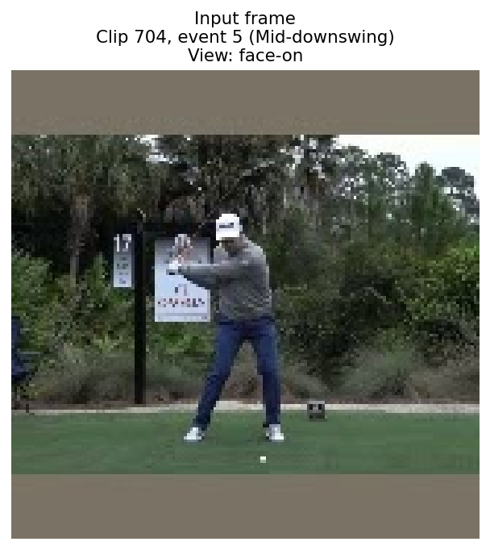
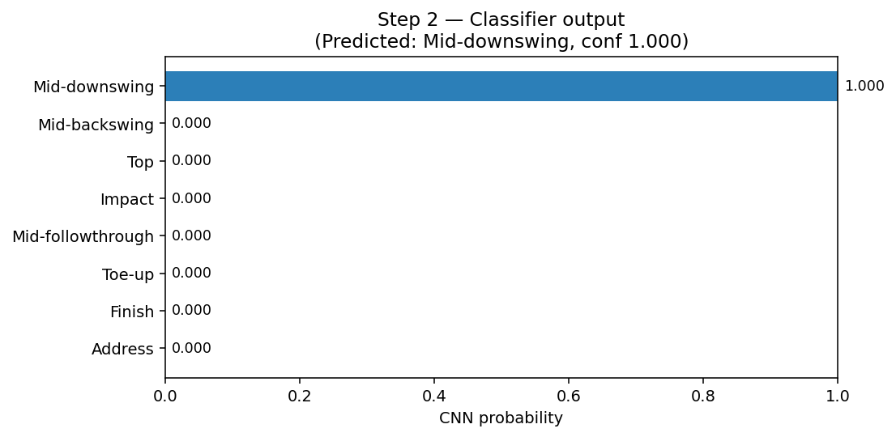
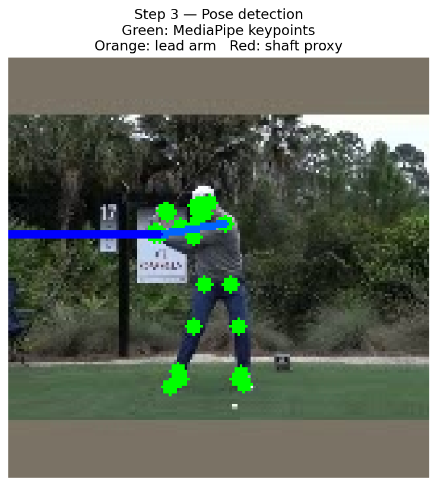
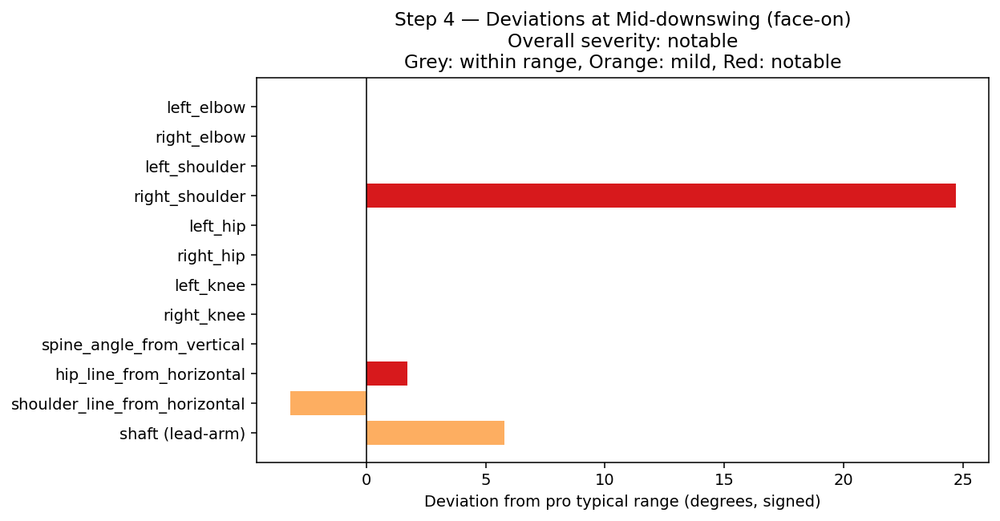

# Pipeline trace: clip0704_event5.jpg

A worked example of the coaching agent pipeline applied to a single frame. This trace was generated automatically by the trace notebook and shows each stage of the pipeline with concrete data.

**Frame**: clip 704, event 5  
**Ground-truth label**: Mid-downswing  
**View**: face-on

## Step 1 — Input



A single 160×160 video frame is the only input to the pipeline.

## Step 2 — Classification

The fine-tuned MobileNetV2 returns a probability over the 8 P-positions:

- **Predicted**: Mid-downswing (confidence 1.000)

- **Top-3 alternatives**:
  - Mid-downswing: 1.000
  - Mid-backswing: 0.000
  - Top: 0.000



## Step 3 — Pose detection

MediaPipe extracts 33 body keypoints; the lead-arm shaft proxy is computed from the lead shoulder and wrist landmarks.



**Joint angles computed**:

- `left_elbow`: 147.1°
- `right_elbow`: 117.8°
- `left_shoulder`: 71.3°
- `right_shoulder`: 85.2°
- `left_hip`: 175.5°
- `right_hip`: 157.8°
- `left_knee`: 172.9°
- `right_knee`: 173.1°
- `spine_angle_from_vertical`: -7.4°
- `hip_line_from_horizontal`: 179.5°
- `shoulder_line_from_horizontal`: -177.7°
- `shaft (lead-arm proxy)`: 179.6° (confidence 0.70)

## Step 4 — Deviation analysis

Each joint angle is compared against the per-(P-position × view) pro reference built from the training set. Deviations outside the p25-p75 range are flagged.

**Overall severity**: notable

| metric | observed | pro range | deviation | severity |
|---|---|---|---|---|
| left_elbow | 147.1° | 141.6-157.6° | 0° | within_typical_range |
| right_elbow | 117.8° | 87.9-133.0° | 0° | within_typical_range |
| left_shoulder | 71.3° | 61.8-79.0° | 0° | within_typical_range |
| right_shoulder | 85.2° | 28.0-60.5° | +24.7° | notable |
| left_hip | 175.5° | 168.4-177.2° | 0° | within_typical_range |
| right_hip | 157.8° | 151.1-161.6° | 0° | within_typical_range |
| left_knee | 172.9° | 167.3-175.4° | 0° | within_typical_range |
| right_knee | 173.1° | 169.2-176.8° | 0° | within_typical_range |
| spine_angle_from_vertical | -7.4° | -11.0--4.7° | 0° | within_typical_range |
| hip_line_from_horizontal | 179.5° | -177.8-177.9° | +1.7° | notable |
| shoulder_line_from_horizontal | -177.7° | -174.4-172.4° | -3.2° | mild |
| shaft (lead-arm proxy) | 179.6° | -173.2-173.9° | +5.8° | mild |



## Step 5 — RAG retrieval

The deviation summary is converted to a natural-language query and embedded with `text-embedding-3-large`. The query searches the Mid-downswing-specific subset of the coaching corpus (filtered by metadata: `p_position=Mid-downswing, document_type=faults`).

**Embedded query**:
> Coaching advice for Mid-downswing swing position. Notable deviations:   right_shoulder is 85.2° (above typical range 28.0-60.5°)   hip_line_from_horizontal is 179.5° (above typical range -177.8-177.9°)   shoulder_line_from_horizontal is -177.7° (below typical range -174.4-172.4°)   shaft (lead-arm proxy) is 179.6° (above typical range -173.2-173.9°)

**Top-3 retrieved chunks** (lower distance = more similar):

### Chunk 1 — distance 0.7000
*Source: `p5_middownswing_faults.md`, section "Over-the-top (outside-in swing path)"*

```
## Over-the-top (outside-in swing path)

**What it looks like:** The club arrives at P5 from outside the target line — the club head is above the hands when viewed from behind, and the shaft approaches steeply from the outside. This is one of the most common faults in amateur golf and produces pulls, pull-slices, and weak contact.

**Detection signal:** `shaft proxy angle` showing the club approaching steep and from outside the target line; `left_shoulder` elevated or "throwing" outward; `shoulder_line_from_horizontal` significantly open (rotating too fast ahead of the lower body).

**Why it h... [truncated for trace]
```

### Chunk 2 — distance 0.7988
*Source: `p5_middownswing_faults.md`, section "Insufficient hip clearance (blocked rotation)"*

```
## Insufficient hip clearance (blocked rotation)

**What it looks like:** At P5, the hips have not rotated sufficiently toward the target. The lead hip has not cleared to the left (for a right-handed player), leaving the body "stuck." The arms swing past the body and the club tends to come from too far inside, causing blocks and pushes.

**Detection signal:** `hip_line_from_horizontal` showing minimal rotation back toward the target; `left_hip` and `right_hip` values showing less forward rotation than the shoulders; weight distribution still heavily on the trail side at P5.

**Why it happens:*... [truncated for trace]
```

### Chunk 3 — distance 0.8270
*Source: `p5_middownswing_faults.md`, section "Early extension (hips thrusting toward ball)"*

```
## Early extension (hips thrusting toward ball)

**What it looks like:** The hips drive forward (toward the ball) rather than rotating. The spine angle decreases — the golfer "stands up" — and the arms have no room to swing through. This causes the club to approach from the inside and below the swing plane, often resulting in blocks, hooks, or fat contact.

**Detection signal:** `spine_angle_from_vertical` decreasing from its address value by more than 8-10°; `right_hip` and `left_hip` showing lateral movement toward the ball rather than rotational clearing; `hip_line_from_horizontal` shifting... [truncated for trace]
```

## Step 6 — Final coaching report

The agent (GPT-5 mini with structured output) synthesizes a `CoachingReport` from steps 1-5.

**Position**: Mid-downswing | **Confidence**: 1.000 | **Assessment**: notable_issues

**Summary**: High-confidence Mid-downswing frame. The upper body (shoulders) appears to be rotating ahead of the lower body while the hips show limited rotational clearance — a pattern consistent with an over-the-top / blocked-rotation issue. Addressing lower-body lead and hip clearance should be prioritized.

**Key deviations surfaced**:
- `right_shoulder`: 85.2° (typical 28.0-60.5°) — *notable*
  - Trail (right) shoulder is substantially more open/elevated than typical pro range, indicating the upper body is rotating ahead of the lower body — a common sign of an over-the-top release or 'throwing' the arms.
- `hip_line_from_horizontal`: 179.5° (typical -177.8-177.9°) — *notable*
  - Hip line shows minimal rotation/clearance toward the target at this position, consistent with insufficient hip clearance (the hips are 'stuck'), which forces the arms to compensate.

**Coaching recommendations**:
1. Initiate the downswing with the lower body before the arms: feel a small 'bump' of the lead hip toward the target so the hips clear and the arms can follow. Drill from corpus: drop a pool ball behind the trail knee and feel the knee move toward the ball before the arms begin the downswing. (Over-the-top section)
2. Use the cue 'clear the lead hip' and practice rotating the lead hip out of the way rather than sliding. Drill from corpus: place an alignment stick next to the lead hip and practice rotating to touch the stick without sliding toward it. (Insufficient hip clearance section)
3. Check for early extension and ensure the trail hip rotates through rather than thrusting toward the ball. Drill from corpus: make downswings with your back against a wall or chair to feel and prevent the hips from thrusting forward. (Early extension section)

**Sources used**: p5_middownswing_faults.md

## Reading the trace

This trace illustrates how each stage of the pipeline contributes to the final coaching feedback:

- The **CNN** provides the position label that anchors the rest of the pipeline. High confidence here is essential — without a correct P-position, the deviation reference is wrong.
- **MediaPipe pose** + the joint-angle computation produce the deterministic measurements. These are the ground truth the deviation analysis is built on.
- The **deviation analysis** is where the system identifies what is unusual. It compares against statistical ranges built from the training-set pro data.
- The **RAG retrieval** grounds the agent's recommendations in the curated coaching corpus, ensuring advice traces to documented coaching principles rather than being free-associated by the LLM.
- The **final report** is the LLM's synthesis. Note how its specific recommendations directly cite both the measured deviations ("trail (right) shoulder is substantially more open/elevated") and the retrieved corpus content (drill descriptions).
