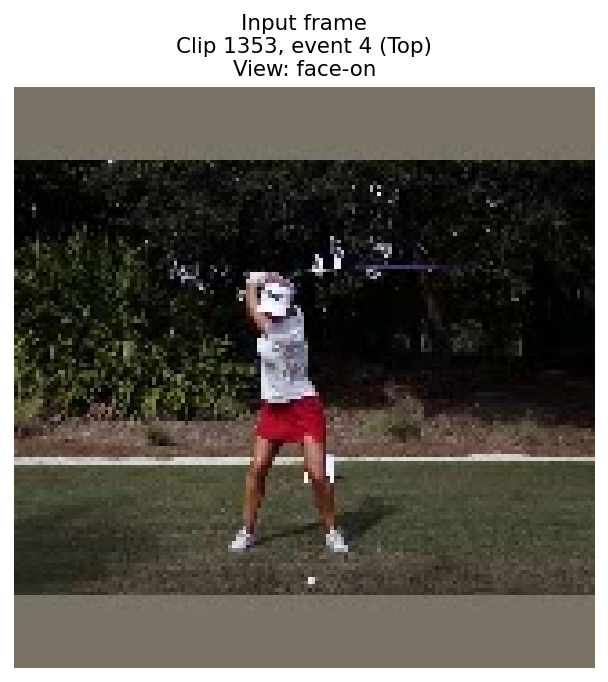
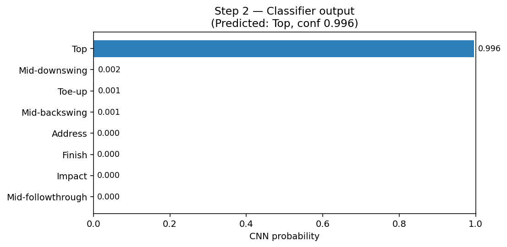
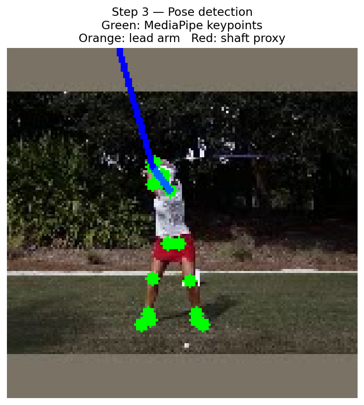
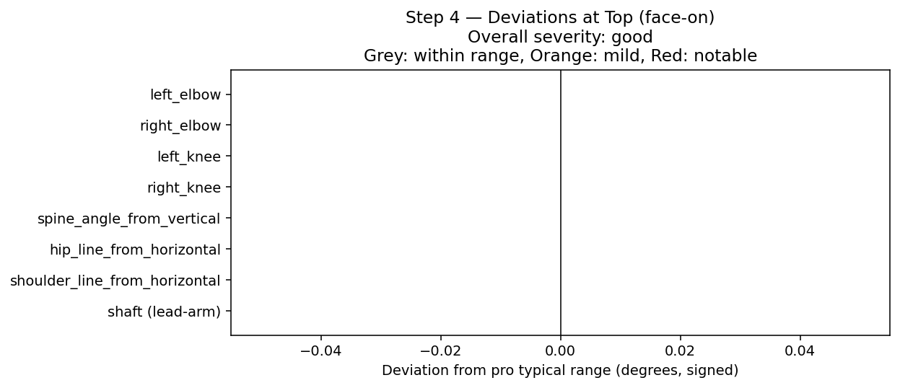

# Pipeline trace: clip1353_event4.jpg

A worked example of the coaching agent pipeline applied to a single frame. This trace was generated automatically by the trace notebook and shows each stage of the pipeline with concrete data.

**Frame**: clip 1353, event 4  
**Ground-truth label**: Top  
**View**: face-on

## Step 1 — Input



A single 160×160 video frame is the only input to the pipeline.

## Step 2 — Classification

The fine-tuned MobileNetV2 returns a probability over the 8 P-positions:

- **Predicted**: Top (confidence 0.997)

- **Top-3 alternatives**:
  - Top: 0.997
  - Mid-backswing: 0.002
  - Toe-up: 0.001



## Step 3 — Pose detection

MediaPipe extracts 33 body keypoints; the lead-arm shaft proxy is computed from the lead shoulder and wrist landmarks.



**Joint angles computed**:

- `left_elbow`: 108.0°
- `right_elbow`: 138.7°
- `left_shoulder`: 122.4°
- `right_shoulder`: 102.7°
- `left_hip`: 175.4°
- `right_hip`: 157.9°
- `left_knee`: 177.4°
- `right_knee`: 163.5°
- `spine_angle_from_vertical`: -4.5°
- `hip_line_from_horizontal`: 176.7°
- `shoulder_line_from_horizontal`: -170.8°
- `shaft (lead-arm proxy)`: -105.4° (confidence 0.70)

## Step 4 — Deviation analysis

Each joint angle is compared against the per-(P-position × view) pro reference built from the training set. Deviations outside the p25-p75 range are flagged.

**Overall severity**: good

| metric | observed | pro range | deviation | severity |
|---|---|---|---|---|
| left_elbow | 108.0° | 93.8-126.2° | 0° | within_typical_range |
| right_elbow | 138.7° | 90.3-155.6° | 0° | within_typical_range |
| left_knee | 177.4° | 165.7-174.2° | 0° | within_typical_range |
| right_knee | 163.5° | 166.9-174.5° | 0° | within_typical_range |
| spine_angle_from_vertical | -4.5° | -10.3--3.2° | 0° | within_typical_range |
| hip_line_from_horizontal | 176.7° | -176.8-177.8° | 0° | within_typical_range |
| shoulder_line_from_horizontal | -170.8° | -167.7-174.8° | 0° | within_typical_range |
| shaft (lead-arm proxy) | -105.4° | -138.1--109.9° | 0° | within_typical_range |



## Step 5 — RAG retrieval

The deviation summary is converted to a natural-language query and embedded with `text-embedding-3-large`. The query searches the Top-specific subset of the coaching corpus (filtered by metadata: `p_position=Top, document_type=faults`).

**Embedded query**:
> Coaching advice for Top swing position.

**Top-3 retrieved chunks** (lower distance = more similar):

### Chunk 1 — distance 0.9096
*Source: `p4_top_faults.md`, section "Overswinging (club past parallel)"*

```
## Overswinging (club past parallel)

**What it looks like:** The club swings past the parallel-to-ground position at the top, sometimes reaching a nearly vertical shaft angle pointing toward the ground. The lead arm is typically well above horizontal, and the lead elbow often collapses significantly to allow the extra range.

**Detection signal:** `shaft proxy angle` indicating the club past parallel (shaft angle greater than 100° past vertical); `left_elbow` angle substantially below 150°; `left_shoulder` elevated significantly above horizontal.

**Why it happens:** Usually results from a co... [truncated for trace]
```

### Chunk 2 — distance 0.9725
*Source: `p4_top_faults.md`, section "Reverse spine angle (C-posture at top)"*

```
## Reverse spine angle (C-posture at top)

**What it looks like:** At the top of the backswing, the upper spine has tilted toward the target rather than away from it. The trail shoulder is higher than the lead shoulder rather than lower. The spine forms a reverse C from a face-on view.

**Detection signal:** `spine_angle_from_vertical` direction reversing from address (tilting toward target side); `right_shoulder` elevated above `left_shoulder` by more than expected; `hip_line_from_horizontal` tilted inconsistently with a proper coil.

**Why it happens:** Often caused by a restricted hip turn ... [truncated for trace]
```

### Chunk 3 — distance 1.0400
*Source: `p4_top_faults.md`, section "Flying trail elbow"*

```
## Flying trail elbow

**What it looks like:** At the top, the trail elbow points outward (away from the body) rather than downward. The trail arm has not folded correctly, causing the elbow to lift and the club to travel on a steep, outside plane.

**Detection signal:** `right_elbow` angle approaching or exceeding 90° in the horizontal plane rather than pointing down; `right_shoulder` position elevated and rotated inconsistently with a connected arm position.

**Why it happens:** Taking the club outside during the takeaway (P2) is the most common cause. The trail elbow rises to compensate for... [truncated for trace]
```

## Step 6 — Final coaching report

The agent (GPT-5 mini with structured output) synthesizes a `CoachingReport` from steps 1-5.

**Position**: Top | **Confidence**: 0.997 | **Assessment**: good

**Summary**: This frame is at the Top of the backswing and the measured joint angles (elbows, knees, spine, hips, shoulders) fall within typical pro ranges — overall technically sound. Shaft direction is unreliable in this frame so no shaft-specific feedback is given. Continue the current movement patterns that produced this position.

**Key deviations surfaced**:

**Coaching recommendations**:
1. Reinforce the current connected trail-arm feel with the "headcover under the trail armpit" drill — this preserves the tucked trail elbow and prevents separation (see p4_top_faults.md).
2. Maintain proper spine tilt and hip rotation by practicing slow backswings with a hand on the trail hip to feel rotation (rather than lateral tilt); use controlled stops (stop at lead-arm parallel) to keep the top position consistent (see p4_top_faults.md).

**Sources used**: p4_top_faults.md

## Reading the trace

This trace illustrates how each stage of the pipeline contributes to the final coaching feedback:

- The **CNN** provides the position label that anchors the rest of the pipeline. High confidence here is essential — without a correct P-position, the deviation reference is wrong.
- **MediaPipe pose** + the joint-angle computation produce the deterministic measurements. These are the ground truth the deviation analysis is built on.
- The **deviation analysis** is where the system identifies what is unusual. It compares against statistical ranges built from the training-set pro data.
- The **RAG retrieval** grounds the agent's recommendations in the curated coaching corpus, ensuring advice traces to documented coaching principles rather than being free-associated by the LLM.
- The **final report** is the LLM's synthesis. Note how its specific recommendations directly cite both the measured deviations ("trail (right) shoulder is substantially more open/elevated") and the retrieved corpus content (drill descriptions).
